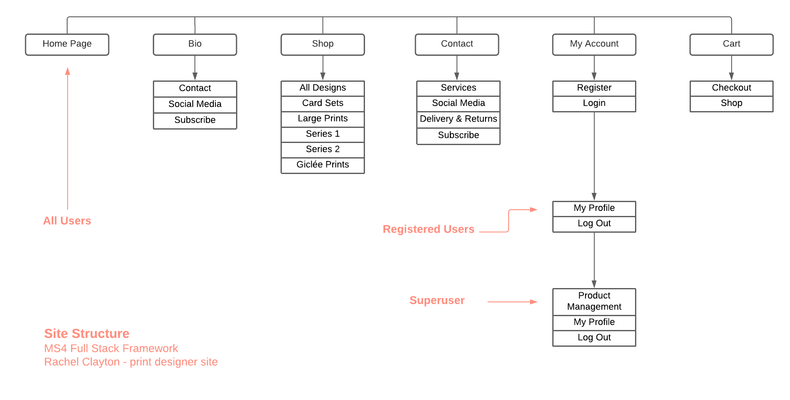
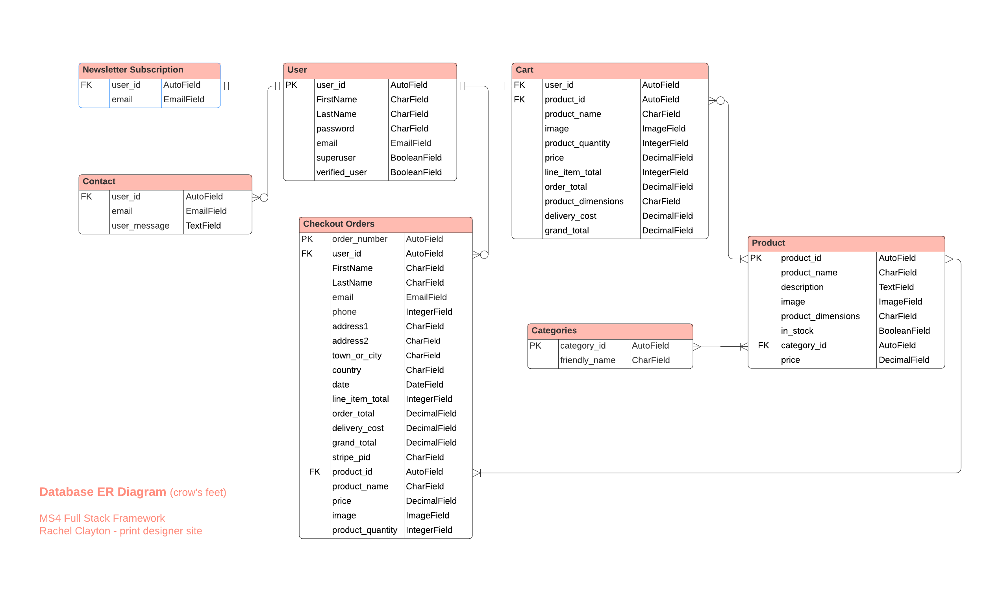

# Rachel Clayton - Print Designer

[Visit site Rachel Clayton]()

The aim of the site is to promote and sell prints created by professinal print deisgner, Rachel Clayton. 
Rachel has many years of expereince as a print and textile lecturer and has developed and curated her own line of abstract screen-printed designs. 
The site showcases a range of Rachel's work, some information about her and an opportunity to purchase her designs. 
This is a full stack project and uses a range of technologies including HTML, CSS, JavaScript, Python (Django framework), Stripe and MySQL.

# Contents
- [1. UX](#UX)
    - [1.1 Target Audience](#1.1-Target-Audience)
    - [1.2 User Stories](#1.2-User-Stories)
    - [1.3 Business Goals](#1.3-Business-Goals)
    - [1.4 Design](#Design)
    - [1.5 Wireframes](#Wireframes)
2. [2. Data and Information Architecture](#Data-and-Information-Architecture)
    - [2.1 Site Structure](#2.1-Site-Structure)
    - [2.2 Database ER Diagram](##Database-ER-Diagram)
3. [3. Features](#3.-Features)
4. [4. Technologies Used](#Technologies-used)
5. [5. Credits](#Credits)

Testing and Deployment can be found in a separate file:
[Testing & Deployment]()

# 1. UX

## 1.1 Target Audience

## 1.2 User Stories

**User Stories**
 - As a user, I would like to be able to navigate around the site easily, with quick access to the shop and gallery.
 - As a user, I would like to be able to search for prints with particular colours or patterns to suit my taste. 
 - As a user, I would like to stay informed and updated about the designer's newest pieces and exhibitions by signing up to an email or newsletter.
 - As a user, I may be interested in requesting a private commission or getting in contact with the designer to ask questions. 
 - As a user, I would like to view the individual products/print designs and information about them such as, a brief description, price and their dimensions.
 - As a user, I want to be a able to loacte and access the designer's social media account so I can follow them.
 - As a consumer, I would like to be able to create my own private account on the site for purchasing products.
 - As a consumer, I would like to know information about delivery and shipping of the prints. 
**Returning User Stories**
 - As a returning consumer, I would like to access my personal account and be able to view my previous purchase history.
 - within my personal account, I would like to be able to add, edit and delete my personal information. 
 - As a returning consumer, I would like to know how to return my order if I need to.
**User Stories - Functionality**
 - As a user, I want the design of the site to be aesthetically appealing with clear navigation and a sense of calm and colour.
 - As a user, I expect the site, payment system and my profile to be safe and secure. 
 - As a user, I want the site to be responsive, for mobile, tablet and desktop.

## 1.3 Business Goals
Rachel would like to showcase herself as an independent professional designer, specialising in screen printing. 
She would like a gallery to display her designs and the opportunity to sell them and make a profit. 
Each print is screen-printed by hand in Rachel's UK-based studio and therefore, unique and individual. 

**Business Owner Stories**
 - As the business owner, I would like a minimalistic approach to site design so the print designs are the focal point.
 - As the business owner, I would like to appeal to possible project collaborations with other designers. 
 - As the business owner, I would like my brand to communicate as a professional, independent designer.
 - As the business owner, I would like to be shown how to add, edit and remove products and their information in order to maintain the site independently, once created.
 - As the business owner, I would like to receive email confirmations of customer orders.
 - As the business owner, I would like to be shown how to view and manage customer orders. 

## 1.4 Design

## 1.5 Wireframes

# 2. Data and Information Architecture

## 2.2 Site Structure

## 2.3 Databse ER Diagram

# 3. Features

# 4. Technologies Used

# 5. Credits

