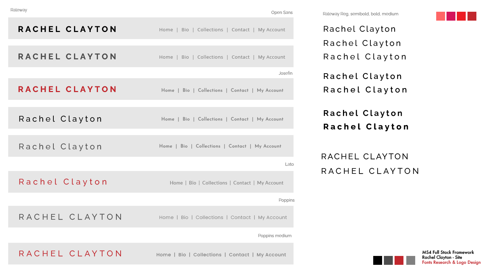
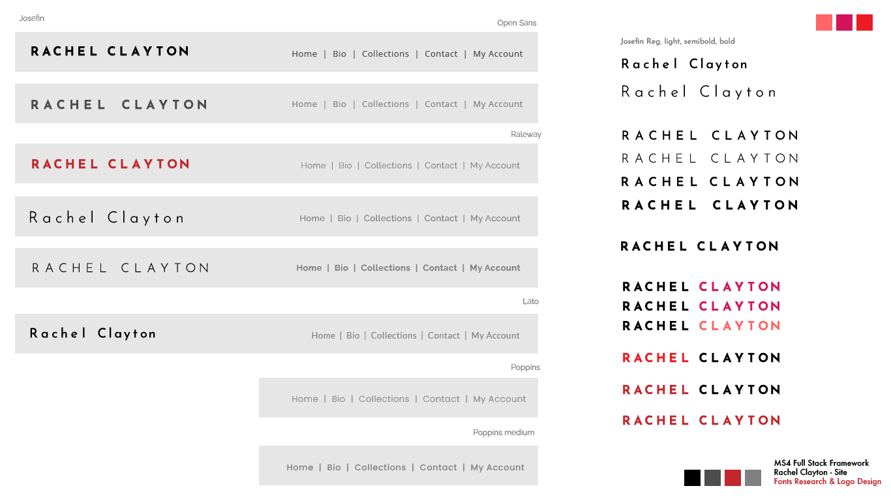
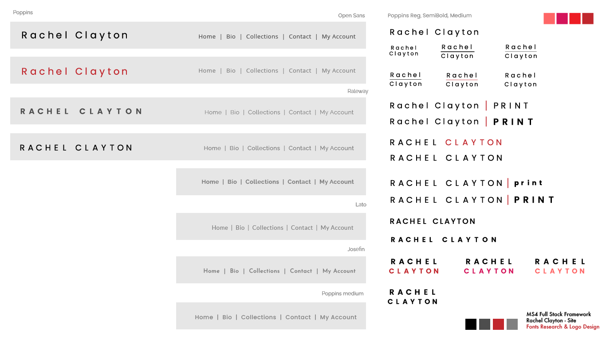

# Rachel Clayton - Print Designer

[Visit site Rachel Clayton]()

The aim of the site is to promote and sell prints created by professinal print deisgner, Rachel Clayton. 
Rachel has many years of expereince as a print and textile lecturer and has developed and curated her own line of abstract screen-printed designs. 
The site showcases a range of Rachel's work, some information about her and an opportunity to purchase her designs. 
This is a full stack project and uses a range of technologies including HTML, CSS, JavaScript, Python (Django framework), Stripe and MySQL.

# Contents
- [1. UX](#1-UX)
- [1.1 Target Audience](#11-Target-Audience)
- [1.2 User Stories](#12-User-Stories)
- [1.3 Business Goals](#13-Business-Goals)
- [1.4 Design](#14-Design)
- [1.5 Wireframes](#15-Wireframes)
- [2. Data and Information Architecture](#2-Data-and-Information-Architecture)
- [2.1 Site Structure](#21-Site-Structure)
- [2.2 Database ER Diagram](#22-Database-ER-Diagram)
- [3. Features](#3-Features)
- [4. Technologies Used](#4-Technologies-used)
- [5. Credits](#5-Credits)

Testing and Deployment can be found in a separate file:
[Testing & Deployment]()

Wireframes can also be found in a separate file:
[Wireframes](https://github.com/RoxJade/rachel-clayton/blob/master/wireframes.md)

# 1. UX

## 1.1 Target Audience

## 1.2 User Stories

**User Stories**
 - As a user, I would like to be able to navigate around the site easily, with quick access to the shop and gallery.
 - As a user, I would like to be able to search for prints with particular colours or patterns to suit my taste. 
 - As a user, I would like to stay informed and updated about the designer's newest pieces and exhibitions by signing up to an email or newsletter.
 - As a user, I may be interested in requesting a private commission or getting in contact with the designer to ask questions. 
 - As a user, I would like to view the individual products/print designs and information about them such as, a brief description, price and their dimensions.
 - As a user, I want to be a able to loacte and access the designer's social media account so I can follow them.
 - As a consumer, I would like to be able to create my own private account on the site for purchasing products.
 - As a consumer, I would like to know information about delivery and shipping of the prints. 
**Returning User Stories**
 - As a returning consumer, I would like to access my personal account and be able to view my previous purchase history.
 - within my personal account, I would like to be able to add, edit and delete my personal information. 
 - As a returning consumer, I would like to know how to return my order if I need to.
**User Stories - Functionality**
 - As a user, I want the design of the site to be aesthetically appealing with clear navigation and a sense of calm and colour.
 - As a user, I expect the site, payment system and my profile to be safe and secure. 
 - As a user, I want the site to be responsive, for mobile, tablet and desktop.

## 1.3 Business Goals
Rachel would like to showcase herself as an independent professional designer, specialising in screen printing. 
She would like a gallery to display her designs and the opportunity to sell them and make a profit. 
Each print is screen-printed by hand in Rachel's UK-based studio and therefore, unique and individual. 

**Business Owner Stories**
 - As the business owner, I would like a minimalistic approach to site design so the print designs are the focal point.
 - As the business owner, I would like to appeal to possible project collaborations with other designers. 
 - As the business owner, I would like my brand to communicate as a professional, independent designer.
 - As the business owner, I would like to be shown how to add, edit and remove products and their information in order to maintain the site independently, once created.
 - As the business owner, I would like to receive email confirmations of customer orders.
 - As the business owner, I would like to be shown how to view and manage customer orders. 

## 1.4 Design

To design the site, I consulted closely with the business owner, Rachel, on all design decisions. 
She gave me a selection of sites to look at for inspiration including [Jonathan Lawes](https://jonathanlawes.com/), [Lucy Merriman](https://www.lucymerrimanart.com/) and [Georigia Elliott](https://www.georgiaelliottartist.com/).
She would like the design of the site to be minimal and sophisticated with the emphasis on the products, her print designs. Based on my research, I selected a range of sophisticated fonts and developed a selection of logo designs and a minimal colour palette for Rachel to choose from.

## 1.5 Wireframes

The wireframe became quite large so I have created a separate file for these, linked below:

[Wireframes](https://github.com/RoxJade/rachel-clayton/blob/master/wireframes.md)

# 2. Data and Information Architecture

## 2.1 Site Structure

## 2.2 Database ER Diagram

# 3. Features

# 4. Technologies Used

- Balsamiq
- Lucid Chart
- [SQLite 3]() Django built-in database during development.
- [Django]() Django python web development framework.
- Django Allauth - Built-in package from Django that handles full user authentication for the site.
- Pillow - to use ImageField in Django database
- [Gunicorn] Web server upon deployment
- [Postgres] Database used upon deployemnt
?- [Jinja Templating](https://jinja.palletsprojects.com/en/2.11.x/) Python templating language used.
- [Font Awesome]() For all site icons
- [Stripe Payment]()
- [Amazon Web Services]() - AWS bucket for static file storage
- [Gitpod and Github](https://github.com/RoxJade/) for version control.
- [Heroku](https://www.heroku.com/home) Site is deployed on Heroku platform.
- [Bootstrap]() Frontend framework used to style the site.
- [JQuery](https://jquery.com/) Javascript functionality to work with Bootstrap.
- HTML
- CSS
- JavaScript
- [Google fonts](https://fonts.google.com/) and [Google icons](https://fonts.google.com/icons). 
- [Adobe Illustrator](https://www.adobe.com/uk/products/illustrator.html) Used for the logo design and mockups.

# 5. Credits

- [Code Grepper](https://www.codegrepper.com/)
- [BBBootstrap](https://bbbootstrap.com/)
- [Wordpress support blog](https://wordpress.org/support/topic/border-around-burger-menu-button/#post-13131740)
- [MD Boostrap](https://mdbootstrap.com/)
- [Academind Bootstrap Tutorial Series](https://www.youtube.com/watch?v=7g8Gg2QVdeU&list=PL55RiY5tL51rLqH4-8LBVlUTIFF70dxhb) - For refreshers on Bootstrap I followed a YouTube Bootstrap tutorial series
- [Stack Overflow](https://stackoverflow.com/) - For troubleshooting
- [Tech with Tim Python Django Tutorial Series](https://www.youtube.com/watch?v=Z4D3M-NSN58&list=PLzMcBGfZo4-kQkZp-j9PNyKq7Yw5VYjq9&index=1) - For additional research on Django I followed a YouTube Django Python tutorial series
- [W3 Schools](https://www.w3schools.com/)
- [LucidChart Tutorials](https://www.youtube.com/watch?v=-CuY5ADwn24) - A series of 2 tutorials on Entity Relationship Diagrams.
## Code Institute
- Dick Vlanderren - My Code Institute Mentor
- [Slack](https://app.slack.com/) - Code institute support communinty
- [Code Institute]() - Hello Django & Boutique Ado tutorials

## Media
All images have been provided by the business owner, Rachel Clayton.
- [Unsplash](https://unsplash.com/)

## Acknowledgements
I received inspiration for ideas, colour palette and design of this project from: 
- [pinterest](https://pinterest.com)
- [current website trends](https://99designs.co.uk/blog/trends/web-design-trends/)
- [dribbble](https://dribbble.com/shots/6492236-Balosto?utm_source=Pinterest_Shot&utm_campaign=Podavalkin&utm_content=Balosto&utm_medium=Social_Share).
- [Jonathan Lawes](https://jonathanlawes.com/)
- [Lucy Merriman](https://www.lucymerrimanart.com/)
- [Georigia Elliott](https://www.georgiaelliottartist.com/)