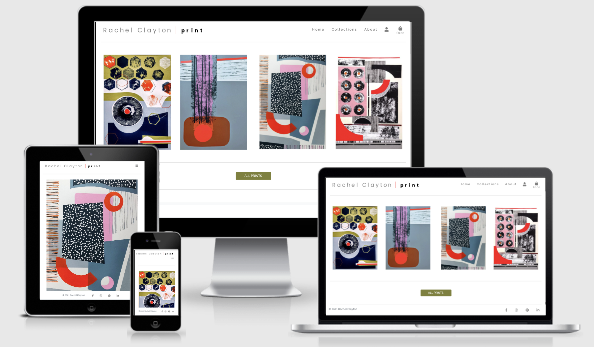
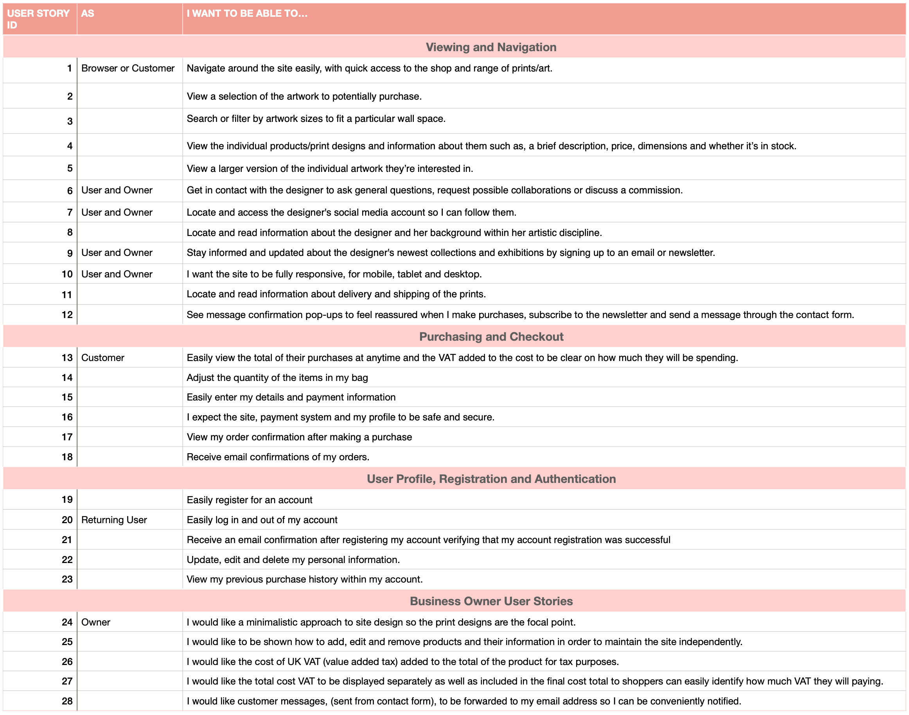
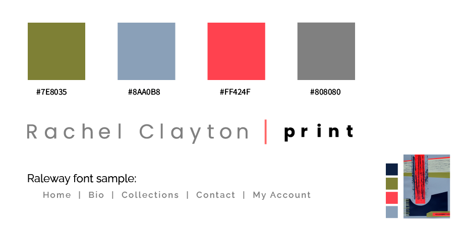

# Rachel Clayton - Print Designer

[Visit site Rachel Clayton](https://rachel-clayton.herokuapp.com/)

The aim of the site is to promote and sell prints created by professinal print deisgner, Rachel Clayton. 
Rachel has many years of expereince as a print and textile lecturer and has developed and curated her own line of abstract screen-printed designs. 
The site showcases a range of Rachel's work, some information about her and an opportunity to purchase her designs. 
This is a full stack project and uses a range of technologies including HTML, CSS, JavaScript, Python (Django framework), Stripe and MySQL.

# Contents
- [1. UX](#1-UX)
- [1.1 Target Audience](#11-Target-Audience)
- [1.2 User Stories](#12-User-Stories)
- [1.3 Business Goals](#13-Business-Goals)
- [1.4 Design](#14-Design)
- [1.5 Wireframes](#15-Wireframes)
- [2. Data and Information Architecture](#2-Data-and-Information-Architecture)
- [2.1 Site Structure](#21-Site-Structure)
- [2.2 Database ER Diagram](#22-Database-ER-Diagram)
- [3. Features](#3-Features)
- [4. Deployment](#4-Deployment)
- [5. Technologies Used](#5-Technologies-used)
- [6. Credits](#6-Credits)

Testing for the site can be found in a separate file:
[Testing](https://github.com/RoxJade/rachel-clayton/blob/master/TESTING.md)

Wireframes can also be found in a separate file:
[Wireframes](https://github.com/RoxJade/rachel-clayton/blob/master/wireframes.md)

# 1. UX

## 1.1 Target Audience
The site is aimed towards art lovers who have an appreciation for abstract art, design and print. It's likely that the audience will be above the age of 25 and earning a reasonable wage, to afford the artwork. 
In most cases the audience will be visiting the site to find 1-2 art pieces. The audience will be looking for a unique and original, hand printed design that makes a statement within their interior.
The audience will value the orignality and authenticity of their artwork, rather than a reproduction or imitation.

## 1.2 User Stories



## 1.3 Business Goals
Rachel would like to showcase herself as an independent professional designer, specialising in screen printing. 
She would like a gallery to display her designs and the opportunity to sell them and make a profit. 
Each print is screen-printed by hand in Rachel's UK-based studio and therefore, unique and individual. 
I would like my brand to communicate as a professional, independent designer.

## 1.4 Design

To design the site, I consulted closely with the business owner, Rachel, on all design decisions. Rachel chose the logo and typeface from the selection of designs below, she also advised on the colour palette she wanted. 
She gave me a selection of sites to look at for inspiration including [Jonathan Lawes](https://jonathanlawes.com/), [Lucy Merriman](https://www.lucymerrimanart.com/) and [Georigia Elliott](https://www.georgiaelliottartist.com/).
She would like the design of the site to be minimal and sophisticated with the emphasis on the products, her print designs.



------------------


------------------


------------------


------------------

## 1.5 Wireframes

The wireframe file is large so I have created a separate file for these, linked below:

[Wireframes](https://github.com/RoxJade/rachel-clayton/blob/master/wireframes.md)


# 2. Data and Information Architecture

## 2.1 Site Structure


## 2.2 Database ER Diagram


# 3. Features

# 4. Deployment

1. I created and named my new app on Heroku.

2. Going back to Gitpod: 
    - I installed **dj_database_url** and **psycopg2-binary** with these commands in the terminal: 
        - `pip3 install dj_database_url`
        - `pip3 install psycopg2-binary`
    - I added these packages to my requirements file with `pip3 freeze -- local > requirements.txt.`
    - Then pushed them to my GitHub repository.

3. Preparing to setup database:
    - I dumped my Categories and Products data into json files with the following commanads:
    - `python3 manage.py dumpdata products.Category > categories.json, python3 manage.py dumpdata products.Product > products.json`

3. Back in Heroku:
    - In the resources tab, I selected the **postgres database**. 
    - This generated the **DATABASE_URL** which can be found in the config vars, which I later added to **settings.py**.

4. In Gitpod, settings.py file:
    - I imported dj_database_url into my settings.py with `import dj_database_url`
    - Then 'commented-out' the default Django database settings and added the Heroku Postgres **DATABASE_URL**:
    ```
    DATABASES = {
        'default': dj_database_url.parse("<DATABASE_URL here>")
    }
    ```
5. In the Gitpod terminal:
    - I ran migrations to create the models for my database with: 
        - `python3 manage.py makemigrations`
        - `python3 manage.py migrate`
    - Then loaded the data fixtures into the categories and products model (in that specific order) with:
        - `python3 manage.py loaddata categories`
        - `python3 manage.py loaddata products`
    - I created a superuser for the main site with `python3 manage.py createsuperuser`

6. In settings.py, **before committing**, I made sure to 'uncomment' the default Django database settings and **remove the DATABASE_URL** to prevent it from saving to version control and created an if/else conditions for when to use each database:
``` if 'DATABASE_URL' in os.environ:
    DATABASES = {
        'default': dj_database_url.parse(os.environ.get('DATABASE_URL'))
    }
else:
    DATABASES = {
        'default': {
            'ENGINE': 'django.db.backends.sqlite3',
            'NAME': os.path.join(BASE_DIR, 'db.sqlite3'),
        }
    } 
``` 

7. Back in the Gitpod terminal:
    - I installed **gunicorn** with `pip3 install gunicorn`
    - Added it to my **requirements.txt**
    - I created a Procfile with the following text: `web: gunicorn <name app>.wsgi:application` for the gunicorn server.
    - I **disabled 'collectstatic'** using `heroku config:set DIABLE_COLLECTSTATIC=1 --app rachel-clayton` to prevent Heroku from collecting the static files upon deployment.

8. In settings.py I added: `ALLOWED_HOSTS = ['rachel-clayton.herokuapp.com', 'locahost']` to allow access to the Heroku site.
    - I then pushed the changes to GitHub and to Heroku using: 
        - `heroku git:remote -a rachel-clayton`
        - `git push heroku master`

9. Connecting Heroku to GitHub 
    - On the deploy tab in Heroku, I clicked **Connect to GitHub** as my deployment method and searched for my repository to **connect** with it. 
    - I then selected **Automatic deployments** so my the changes I make in development are pushed to Heroku as well.

10. I added all keys and values to the Heroku config vars needed for the project to run, **replacing two keys** that were in my version control commits. These were:
    - Django SECRET_KEY, which I replaced in settings.py with: `SECRET_KEY = os.environ.get('SECRET_KEY', '')`
    - EMAIL_HOST_PASS (committing this one to version control was an accident!)

    | KEY            | VALUE         |
    |----------------|---------------|
    | AWS_ACCESS_KEY_ID | `<aws access key>`  |
    | AWS_SECRET_ACCESS_KEY | `<aws secret access key>`  |
    | DATABASE_URL| `<postgres database url>`  |
    | EMAIL_HOST_PASS | `<email password(generated by Gmail)>` |
    | EMAIL_HOST_USER| `<email address>`  |
    | MAILCHIMP_API_KEY| `<api key>`  |
    | MAILCHIMP_DATA_CENTER| `<datacenter id>`  |
    | MAILCHIMP_EMAIL_LIST_ID| `<emailist id>`  |
    | SECRET_KEY | `<secret key>`  |
    | STRIPE_PUBLIC_KEY| `<stripe public key>`  |
    | STRIPE_SECRET_KEY| `<stripe secret key>`  |
    | STRIPE_WH_SECRET| `<stripe wh key>`  |
    | USE_AWS | `True`  |
    
11. Finally, I added a condition to debug, only in development with: `DEBUG = 'DEVELOPMENT' in os.environ`. 

## Hosting static and media files with AWS
All of my static and media files are hosted in the AWS S3 Bucket. To do this, I created an S3 bucket, set a group, policy and user in the IAM environment. Then loaded all of my media files and static files into it. 

# 5. Technologies Used

### **Site Design and Structure:**
- [**Balsamiq**](https://balsamiq.com/) for [wireframes](https://github.com/RoxJade/rachel-clayton/blob/master/wireframes.md) 
- [**Lucid Chart**](https://www.lucidchart.com/) to create Database ER diaram and site structure.
- [**Adobe Illustrator**](https://www.adobe.com/uk/products/illustrator.html) for logo design, font selections and colour.

### **Django and additional installed packages:**
- [**Django**](https://www.djangoproject.com/) Django python web development framework.
    - **SQLite3** Django default built-in database during development.
    - **Django Allauth** - Built-in package from Django that handles full user authentication for the site.
    - **Pillow** - to use 'ImageField' in Django database
    - **gunicorn** - web server upon deployment
    - **dj_database_url** - to change to Postgres database for deployment.
    - **crispy-forms** - for forms and validation
    - **psycopg2-binary** - for database adaption to Postgres

### **Site Development:**
- [**Gitpod and Github**](https://github.com/RoxJade/) IDE, Git version control and repository.
- [**Heroku**](https://www.heroku.com/home) Site is deployed on Heroku platform.
- **Heroku Postgres** Database used upon deployment
- **HTML**
- **CSS**
- [**Bootstrap**]() Frontend framework used to style the site.
- [**Javascript/JQuery**](https://jquery.com/) Javascript functionality to work with Bootstrap.
- [**Font Awesome**](https://fontawesome.com/) For all site icons
- [**Google fonts**](https://fonts.google.com/) and [**Google icons**](https://fonts.google.com/icons). 

### **API's:**
- [**Stripe Payment**](https://stripe.com/) - API used for user transactions.
- [**Amazon Web Services**](https://aws.amazon.com/) - AWS S3 bucket for media and static file storage.
- [**Mailchimp**](https://mailchimp.com/) API used to setup Newsletter subcription feature.

# 6. Credits

## Acknowledgements
- **Rachel Clayton**, the business owner and artist, who provided all images of her print designs and site content.

I received inspiration for ideas, colour palette and design of this project from: 
- [Georigia Elliott](https://www.georgiaelliottartist.com/)
- [dribbble](https://dribbble.com/shots/6492236-Balosto?utm_source=Pinterest_Shot&utm_campaign=Podavalkin&utm_content=Balosto&utm_medium=Social_Share).
- [Jonathan Lawes](https://jonathanlawes.com/)
- [Lucy Merriman](https://www.lucymerrimanart.com/)

**Code Institute**
- **Dick Vlanderren - My Code Institute Mentor**
- [Slack](https://app.slack.com/) - Code institute support communinty
- [Code Institute]() - Tutor Assistance Team and tutorials, Hello Django & Boutique Ado

**For hints, help, guidance and small bug fixes I used:**
- [Stack Overflow](https://stackoverflow.com/) - For troubleshooting
- [Code Grepper](https://www.codegrepper.com/)
- [BBBootstrap](https://bbbootstrap.com/)
- [Wordpress support blog](https://wordpress.org/support/topic/border-around-burger-menu-button/#post-13131740)
- [MD Boostrap](https://mdbootstrap.com/)
- [W3 Schools](https://www.w3schools.com/)
- [Bootrap 4 Docs](https://getbootstrap.com/docs/4.5/getting-started/introduction/)
- [Tango with Django](https://tango-with-django.readthedocs.io/en/latest/chapters/models.html)
- [Django Docs](https://docs.djangoproject.com/en/3.2/) 
- [Cory Shaefer Django tutorial series](https://www.youtube.com/watch?v=UmljXZIypDc&list=PL-osiE80TeTtoQCKZ03TU5fNfx2UY6U4p)
- [Academind Bootstrap Tutorial Series](https://www.youtube.com/watch?v=7g8Gg2QVdeU&list=PL55RiY5tL51rLqH4-8LBVlUTIFF70dxhb)
- [LucidChart Tutorials](https://www.youtube.com/watch?v=-CuY5ADwn24)

**Resources for 2 additional models, Newsletter and Contact features:**
- [Just Django - YouTube tutorial](https://www.youtube.com/watch?v=2KeV42YaPes)
- [Tech with Tim Python Django Tutorial Series](https://www.youtube.com/watch?v=Z4D3M-NSN58&list=PLzMcBGfZo4-kQkZp-j9PNyKq7Yw5VYjq9&index=1)
- [Codemy.com YouTube tutorial](https://www.youtube.com/watch?v=xNqnHmXIuzU)


