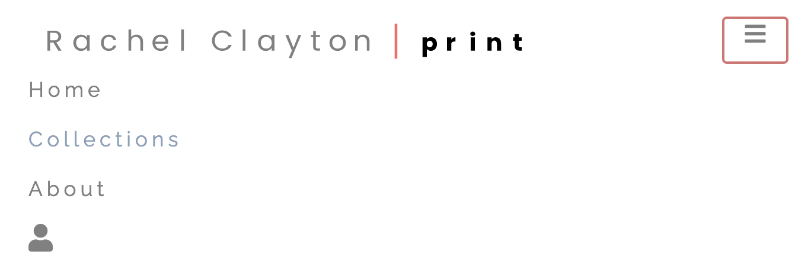
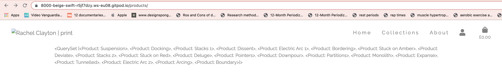
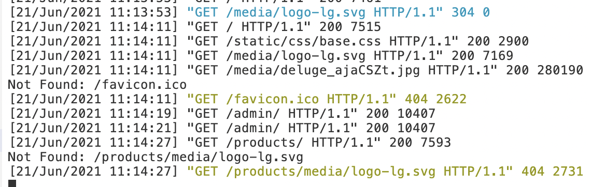

# Problem solving:

**Navbar**

When designing the navbar I had a few issues with spacing as the client wanted wide letter spacing on the navlinks. This caused a few more problems with the layout on responsive screens. To solve this, I had to add some additional media queries. 
I also found a bug on the navbar toggler icon. Upon clicking, it created a red border around the icon. After researching I found that this was a built in bug from Bootstrap and I found some custom css, from a blog, to remove the border - [Border around burger - Cyrill](https://wordpress.org/support/topic/border-around-burger-menu-button/#post-13131740):
<br>
``` CSS
* {
    -webkit-tap-highlight-color: rgba(236, 12, 12, 0) !important; 
    -webkit-focus-ring-color: rgba(255, 255, 255, 0) !important; 
    outline: none !important;
}
```



----------

**Logo issues - extending to other templates**

Once I had created the base.html with the navabr and footer for the site, I used  in other templates, to load the navbar and footer through the site. 
However, the brand logo svg file did not load properly. After looking at the terminal, I realised that it was being searched for in the wrong file path, causing a 404 error and broken image. 
I researched into this on the [Django docs - Static files](https://docs.djangoproject.com/en/3.2/howto/static-files/) and realised that the logo.svg needed to be stored in Static directory, rather than in the Media folder. 
To solve, I created an img folder in the static directory and dropped logo.svg in, then I altered my file path in base.html, from:
<br>
`` 
<br>
to 
<br>
`` 
<br>
Then it worked fine across all templates.




