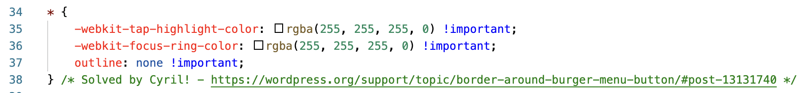

# Problem solving:

When designing the navbar I had a few issues with spacing as the client wanted wide letter spacing on the navlinks. This caused a few more problems with the layout on responsive screens. To solve this, I had to add some additional media queries. 
I also found a bug on the navbar toggler icon. Upon clicking, it created a red border around the icon. After researching I found that this was a built in bug from Bootstrap and I found some custom css from a blog to remove the border - [Border around burger - Cyrill](https://wordpress.org/support/topic/border-around-burger-menu-button/#post-13131740)

----------
