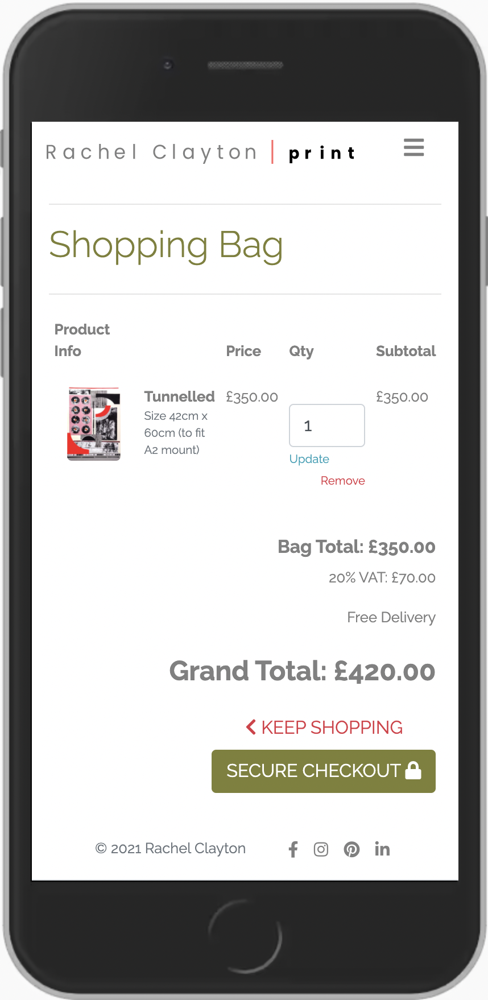

# Testing - Rachel Clayton Site

[Visit site Rachel Clayton](https://rachel-clayton.herokuapp.com/)

# Contents
- [1. Manual Site Testing](#1-Manual-Site-Testing)
- [2. User Stories Testing](#2-User-Stories-Testing)
- [2.1 Viewing and Navigation](#21-Viewing-and-Navigation)
- [2.2 Purchasing and Checkout](#22-Purchasing-and-Checkout)
- [2.3 User Profile, Registration and Authentication](#23-User-Profile-Registration-and-Authentication)
- [2.4 Business Owner User Stories](#24-Business-Owner-User-Stories)
- [3. Responsive Testing](#3-Responsive-Testing)
- [4. Automated Testing](#4-Automated-Testing)
- [5. Browser Testing](#5-Browser-Testing)
- [6. Development and Problem Solving and Bugs](#6-development-and-Problem-Solving-and-Bugs)

# 1. Manual Site Testing

Manual tests run for all functionality of site 

**The main navbar:**
- 'Home', (This link is also added to the logo),
- 'Collections', with a drop-down of 'All Prints' and 3 filtered selection links of the artwork,
- 'About', with a drop-down of 'Contact' and 'Delivery and Returns',
- 'Profile icon', with a drop-down of 'Register', 'Login', 'My Account' (for registered users), 'Product Management' (for Super-User), 'Logout'
- 'Bag icon', takes shoppers straight to their bag.

All main navigation links work: **Test Passed**

**The Footer:**
- 'Facebook icon', opens in new window when clicked, takes user to Rachel's Facebook Profile,
- 'Pinterest icon', opens in new window when clicked, takes user to Pinterest,
- 'Instagram icon', opens in new window when clicked, takes user to Rachel's Instagram Profile,
- 'LinkedIn icon', opens in new window when clicked, takes user to Rachel's LinkedIn Profile,

All footer links work: **Test Passed**

**Home Page / index.html**
- 'Carousel arrows left and right'(only on small screen sizes),
- 'All Prints' button, takes user to 'All Prints'
- 'Subscribe feature' 
    - field validates as expected, 
    - 'Subscribe' button returns a 'success message' to user notifying they 'succesfully signed up' 
    - **subscriber is successfully added to database and 'MailChimp API' subscriber list**

All Home Page / index.html links, buttons, form, MailChimp backend connection work: **Test Passed**

**Collections**
- 'All Prints', takes users to all artwork 
- 'A2 & A3 Screen Prints', filters 'All Prints' and shows users all A2/A3 screenprints
- 'A2 & A3 Mixed Media', filters 'All Prints' and shows users all A2/A3 monoprints
 - 'Square Prints', filters 'All Prints' and takes users to 1 lonely square print filter (Rachel is in the process of creating more and will add more designs to this category soon)
    - 'Up Arrow' (at bottom of all collections pages) takes user to top of the page upon click
- 'Image link' embedded in every image takes user to individual product details

All Collections pages and links work: **Test Passed**

**Contact, Delivery and Returns pages**
- 'Contact form', 
    - each field validates as expected, '
    - Send message' button returns a specialised 'success message'
    - **successfully sends the received message onto the email address of the superuser/site owner (currently directed at my own email address - this will be changed to Rachel's eventually)**
- 'All Prints' takes users to 'All Prints'
- 'contact page' link within returns policy takes users direclty to the contact form on the 'Contact Page'

All Contact, Delivery and Returns form, links and email send functionality work: **Test Passed**

**Product Management (only works for registered Super-Users)**
- 'Product Management.html' cannot be found or forced into by un-verified users, only super-users have access'
- 'Add Product', 
    - each field validates as expected, 
    - it successfully receives images uploaded by user and returns a thumbnail, 
    - 'Add Product' button returns a specialised 'success message', 
    - form submission directs user to the new 'Product Detail' view, 
    - adds the new product to 'All Prints'  
- 'Edit Product', 
    - returns a specialised 'alert message' to notify 'user now editing', 
    - each field validates as expected, 
    - it successfully receives/removes images uploaded by user and returns a thumbnail, 
    - 'Update Product' button returns a specialised 'success message', 
    - form submission directs user to the edited 'Product Detail' view
    - adds product edits to 'All Prints'
- 'Delete Product', 
    - deletes product, returns a specialised 'success message' to notify 'product deleted' * It would have been better practice to add a defensive model pop-up, checking if user would definitely like to delete the product, before deletion. This is something I will add in the future. 
- 'Cancel' button link (on all product management pages) takes user to 'All Prints'
- 'All Prints' / 'Product Details' have 'edit' and 'delete', links work as expected

All Product Management links, features, forms and buttons work: **Test Passed**

**Product Detail**
- Product detail displays correct information, Name, Price, Description, Dimensions, 'In-Stock' status
- When 'In Stock' quantity field and 'Add to Cart' are available, when not 'In Stock', they disappear and user cannot purchase product
- 'Keep Shopping' link button returns user to 'All Prints'
- quantity field increments between 1-10 only
- 'Add to Cart' button takes users to shopping cart, 
    - returns a specialised 'success message' to user displaying 'mini cart' with bag quantity, thumbnail of product, product name, product size, free delivery, VAT percentage, grand total
    - 'link to 'Secure Checkout' takes user to checkout.html
    - triggers bag icon in navbar to display running total below icon

All Product Details links, features, forms, messages and buttons work: **Test Passed**

**Register**
- 'Sign In' link directs user to Sign In page
- each field validates as expected, (recognises when users are already registered and won't allow to go further)
- 'Sign Up' button takes user to email verification page and a displays message 'please confirm via email'
- 'Email verification succesfully receives to email address 
- Clicking email link returns user to the site and returns a specialised 'success message'

All Register links, forms, messages, buttons and email verification process work: **Test Passed**

**Sign In**
- each field validates as expected, 
- 'Sign In' button directs user to home page
- returns a specialised 'success message'

Sign In Form, message and button work: **Test Passed**

**Logout**
- 'Sign Out' button returns user to home page, removing the ability to view their account
- returns a specialised 'success message'

Logout function, message and button work: **Test Passed**

**My Account/Profile.html**
- displays account details, with opportunity to update, and order history,
- each field validates as expected, 
- 'Update Information' button submits updated info and returns the updated form
- returns a specialised 'success message'

Account forms, features, message and button work: **Test Passed**

**Shopping bag**
- displays product details, price, incremental quantity, subtotal cost of item quantity, bag total before VAT/delivery, VAT cost, grand total
- quantity field increments between 1-10 only
- 'update' button updates bag successfully and returns a specialised 'success message'
- 'remove' button successfully removes item from bag and returns a specialised 'success message'
- 'Secure Checkout' button takes user to checkout.html 
- 'Keep Shopping' link returns users to all prints

Shopping bag forms, features, messages and buttons work: **Test Passed**

**Checkout & Checkout Success**
- displays order summary with bag item quantity, costing details and order form
- each field validates as expected, 
- 'save delivery info' checkbox successfully saves user info to account upon ticking
- **Stripe payment accepts test card number '4242 4242 4242 4242' (any numbers for MM/YY CVC)**
- 'Adjust bag' link takes user back to bag
- 'Complete Order' link displays 'loading overlay' succesfully whilst processing payment
- **Stripe Webhook handler's are successful**
- successul payment returns a success message notifying the customer, 'order has been successfully processed and an email confirmation will be sent (includes order number)'
- unsuccessful processing (resulting in loading overlay remaining or customer accidentally exits window) are picked up by the webhook handler
- An email order confirmation is succesfully sent through to the recipient's email address
- Order and delivery information is displayed
- 'Continue Browsing' button returns user to 'All Prints'
- 'Delivery and Returns' button directs user to the delivery and returns.html
- Order is added and viewable in the user's account

Chcekout and checkout success forms, features, messages, buttons, web handlers and payment functionality work: **Test Passed**

--------------------

# 2. User Stories Testing

## 2.1 Viewing and Navigation

**1. Navigate around the site easily, with quick access to the shop and range of prints/art.**
- A user can navigate around the site using the main navbar and conveniently placed links. The navbar collapses into a 'hamburger' icon at medium screen breakpoint for mobile and tablet users.

**2. View a selection of the artwork to potentially purchase.**
-  users can navigate to the 'collections' and find all artwork within those links, they can also access it via the 'All Prints' button on the homepage

**3. Search or filter by artwork sizes to fit a particular wall space.**
- users can navigate to the 'collections' link in the navbar and view the drop-down links, these links filter the artwork by size and type.

4. View the individual products/print designs and information about them such as, a brief description, price, dimensions and whether it’s in stock.
- users can view the individual artwork by clicking on any individual artwork image within the collections. There, they will see all of the details about the item they are interested in.

5. View a larger version of the individual artwork they’re interested in.
- when users view an individual print, they can click on the image. This will enhance the size of the image. 

6. Get in contact with the designer to ask general questions, request possible collaborations or discuss a commission. 
- users can get in contact with the designer by navigating to the contact page. There, they will find a contact form, upon submitting the form, Rachel will receive the recipients messages.(These are currently directed at my email address for testing purposes.)

7. Locate and access the designer's social media account so I can follow them.
- all of Rachel's social media links can be found along the bottom of the site, in the footer. These include links to her Facebook, Instagram, LinkedIn and Pinterest.

8. Locate and read information about the designer and her background within her artistic discipline.
- users can locate information about Rachel and her artistic background in the about section on her contact page.

9. Stay informed and updated about the designer's newest collections and exhibitions by signing up to an email or newsletter.
- users can subscribe to the mailing list which can be found on the homepage of the site. Once users are subscribed, Rachel will have access to the subscriber list on Mail Chimp and can use this platform to compose and send marketing emails.

**10. I want the site to be fully responsive, for mobile, tablet and desktop.**
- The site is fully responsive across all screen sizes, including a variation of mobile phone screen sizes, tablet screens, laptop and large desktop screens. I created an additional media query for smaller mobile screen sizes as well as larger mobile screen sizes.

11. Locate and read information about delivery and shipping of the prints.
- delivery, shipping and returns information can all be found in the delivery and returns page under the contact link.

12. See message confirmation pop-ups to feel reassured when I make purchases, subscribe to the newsletter and send a message through the contact form.
- the site has a selection of message pop-ups, these include success, error, alert and info messages. Different messages will be triggered based on user interaction.

## 2.2 Purchasing and Checkout
13. Easily view the total of their purchases at anytime and the VAT added to the cost to be clear on how much they will be spending. 
- customers will be able to view the running total in the navbar below the bag icon in the far corner
- they will also receive a success message, detailing the VAT to be added to the total cost

14. Adjust the quantity of the items in my bag
- users can adjust the quantity of items in the bag and in the Checkout
- the individual quantity of the items will not succeed 10

15. Easily enter my details and payment information
- the stripe payment process is fairly straightforward, the form is easy to populate, with placeholder hints in the form fields
- the form also has an option 'check box' to save the users delivery information to their account and reuse for future purchases, making the experience even quicker second time around.

16. I expect the site, payment system and my profile to be safe and secure. 
- The transactions require Stripe, a secure payment service.

17. View my order confirmation after making a purchase
- upon making a purchase, a customer will be shown their order confirmation.
- an order confirmation will also be sent to you that email address
- They will also be able to view their order history in the user profile account.

18. Receive email confirmations of my orders.
- users will receive an email confirmation of the order.

## 2.3 User Profile, Registration and Authentication

19. Easily register for an account
- users can easily register for an account on the register page, the form is straightforward with hints in the placeholders.

20. Easily log in and out of my account
- users can easily log in and out by accessing the profile icon in the navbar and choose 'sign in' or 'log out'.

21. Receive an email confirmation after registering my account verifying that my account registration was successful
- upon registering for a new account, users will receive an email requesting them to verify their email address.

22. Update, edit and delete my personal information. 
- within each user account, the user can update edit and delete their personal information.

23. View my previous purchase history within my account.
- users can view their previous purchase history within their user profile account.

# 2.4 Business Owner User Stories
24. I would like a minimalistic approach to site design so the print designs are the focal point.
- the site design is fairly minimal, using plenty of white space, a calm font style and calmer accent tones, with the majority of focus on the beautiful print designs.

25. I would like to be shown how to add, edit and remove products and their information in order to maintain the site independently.
- as a registered super user, Rachel will have access to the product management link, where she will be able to add, edit and remove her products and all of their information, including images.

26. I would like the cost of UK VAT (value added tax) added to the total of the product for tax purposes.
- The equation to calulate UK VAT of 20%, has been added to the grand total sum of each customer spend and can be seen in the bag and checkout pages.

27. I would like the total cost VAT to be displayed separately as well as included in the final cost total to shoppers can easily identify how much VAT they will paying.
- the total cost of the VAT, before it is added to the grand total, is shown in the bag and at the checkout.

28. I would like customer messages, (sent from contact form), to be forwarded to my email address so I can be conveniently notified.
- all customer messages are forwarded onto Rachels email address. (My address is currently being used for this for tests.)

-------------------

# 3. Responsive Testing

To maintain a responsive approach during the development of my site, I used the Chrome Dev tools and checked the responsiveness against the following devices with different screen sizes:

- Moto-G4 
- iPhone 5/SE
- iPhone 6/7/8
- iPhone 6/7/8 +
- iPhone X
- iPad 
- iPad Pro
- Pixel 2
- Pixel 2 XL
- Surface Duo

During this process I realised I that the Boostrap built-in class of 'small' breakpoint, was not small enough to support some of the smallest screen sizes such as iPhone 5 and Moto-G4.
For this reason I added an additional breakpoint for 'very small screen sizes to my CSS. 
I tried to primarily use Bootstrap classes and grid system to control the responsiveness of the site, but at times, I needed to add tweaks to CSS. 
Below are some examples of my site on a variety of screen sizes:




<hr>

<hr>


# 4. Automated Testing

## Lighthouse 
The original score that Lighthouse gave my website was a bit low, in particular, I wasn't very pleased with the Performance.
I read through the lighthouse report and followed some of the advice, amending and removing any unecessary HTML and CSS based on Lighthouse's report. 
After running my code for the second time through in Lighthouse, I saw a bigger improvement in the performance. In the future, I'd like to figure out how to improve this even further. 


<hr>


## HTML

[W3 Validator](https://validator.w3.org/)
- with the exception of some minor errors, such as removing 'alt' attributes from the wrong location and warnings the sections lack headings, the HTML didn't conatin any significant errors.

**Test Passed**

## Python

[PEP8](http://pep8online.com/)
- With the exception of a lines too long that I missed when I refactored my code, there were no significant errors found.

**Test Passed**

## javascript

[JS Hint](https://jshint.com/)
- No serious errors. Issued some warnings below:
'template literal syntax' is only available in ES6 (use 'esversion: 6')
'let' is available in ES6 (use 'esversion: 6') or Mozilla JS extensions (use moz).

**Test Passed**

## CSS

[CSS Validator Jigsaw](https://jigsaw.w3.org/css-validator/validator)
- Found No errors in the CSS file! 

**Test Passed**

# 5. Browser Testing

Browsers are used for testing included:

- Google Chrome
- Mozilla Firefox 
- Microsoft Edge
- Safari

In all four web browsers, I did not have problem, accessing any part of my site, nor had it changed or altered in any way.
Testing in these sites was very successful

Results: 
**Test Passed**

# 6. Development and Problem Solving and Bugs

**Navbar**

When designing the navbar I had a few issues with spacing as the client wanted wide letter spacing on the navlinks. This caused a few more problems with the layout on responsive screens. To solve this, I had to add some additional media queries. 
I also found a bug on the navbar toggler icon. Upon clicking, it created a red border around the icon. After researching I found that this was a built in bug from Bootstrap and I found some custom css, from a blog, to remove the border - [Border around burger - Cyrill](https://wordpress.org/support/topic/border-around-burger-menu-button/#post-13131740):
<br>
``` CSS
* {
    -webkit-tap-highlight-color: rgba(236, 12, 12, 0) !important; 
    -webkit-focus-ring-color: rgba(255, 255, 255, 0) !important; 
    outline: none !important;
}
```


----------

**Logo issues - extending to other templates**

Once I had created the base.html with the navabr and footer for the site, I used  in other templates, to load the navbar and footer through the site. 
However, the brand logo svg file did not load properly. After looking at the terminal, I realised that it was being searched for in the wrong file path, causing a 404 error and broken image. 
I researched into this on the [Django docs - Static files](https://docs.djangoproject.com/en/3.2/howto/static-files/) and realised that the logo.svg needed to be stored in Static directory, rather than in the Media folder. 
To solve, I created an img folder in the static directory and dropped logo.svg in, then I altered my file path in base.html, from:
<br>
`` 
<br>
to 
<br>
`` 
<br>
Then it worked fine across all templates.


**Later on...** I realised the reason this wasn't working was due to the fact that I had not included the `media context processor` in my settings.py file. 
I added this later but chose to leave the logo in it's static/image directory as this worked and was an acceptable solution according to Django docs. 

----------

**Creating a view for calculating VAT**

----------

**Small typo that tested a try/exception block**

Whilst creating the 'remove_from_bag' function, I was confronted with an error 500 status, (from the try/except block I had added in the bag view). 
This acted as a mini-test for my code and describde the error in the terminal as a missing 'forward slash'. I knew that the typo had to exist in the 
javascript as the post method wasn't working and the error was well described. After searching through, I found and added the missing '/'.
This accidental mistake tested my try/exception block in the bag views succesfully and helped me to resolve the issue. 

----------

**Image upload issues**

After creating the models for the database, I added the product photos. Once they uploaded in the Django admin database, I noticed their file names changed. I tried reloading them but it didn't make any difference. As the images were still working correctly, I left the issue for a while. 
However, once I deployed the project to Heroku and loaded the image files to the AWS S3 bucket, they didn't have the correct file links for the images. To solve this, I edited all of the file names to match correctly in the deployed site. 
This solution worked, but after researching into the Django docs, I found the resason why this happens and a more suitable solution to use future. [It can be found here](https://docs.djangoproject.com/en/dev/ref/models/fields/#filefield).

----------

**Minor Bug Fix**

After deployment, I realised a site user could still add a 'sold' item to their bag. To fix this, I created an if/else condition to prevent the 'add-to-bag' button from being seen if the item was 'sold'.

----------

**Stripe Issues**

- I found adding Stipe to the project fairly straight forward, with one exception. After stopping the Gitpod workspace for a while and re-opening, some of the '£' signs in the chcekout and bag views had changed to '$' signs. I checked I had set my currency on Stripe to GBP, which was correct. 
    Once I changed these back in the HTML tenplates, this solved the issue and has not occurred since, however, I did find there were some occurrences of it happeneing to other users on the Slack Community and it was suggested the issue stems from Stripe.

- I used Crispy forms to create and validate the all of the forms in the site. I appreciated the time it saved with minimal styling needed and the validation completely handled. 
    On the checkout page however, the field for country would not allow users to enter 'UK', it has to be 'GB'. This was not quite as user-friendly as I would have liked, it's something I'd like to alter in the future. For now, I added a small sentence in the placeholder to inform users to use GB instead UK.

----------

**Accidentally commit EMAIL_HOST_PASS password into version control**

Whilst working to develop the contact app, I accidentally committed and pushed my code to my GitHub repo whilst the Gmail `EMAIL_HOST_PASS` password still existed in my settings.py file. 
I made sure to replace this upon deployemnt, at the same time as replacing the Django `SECRET_KEY`. I then added them both to the config variables in Heroku.
